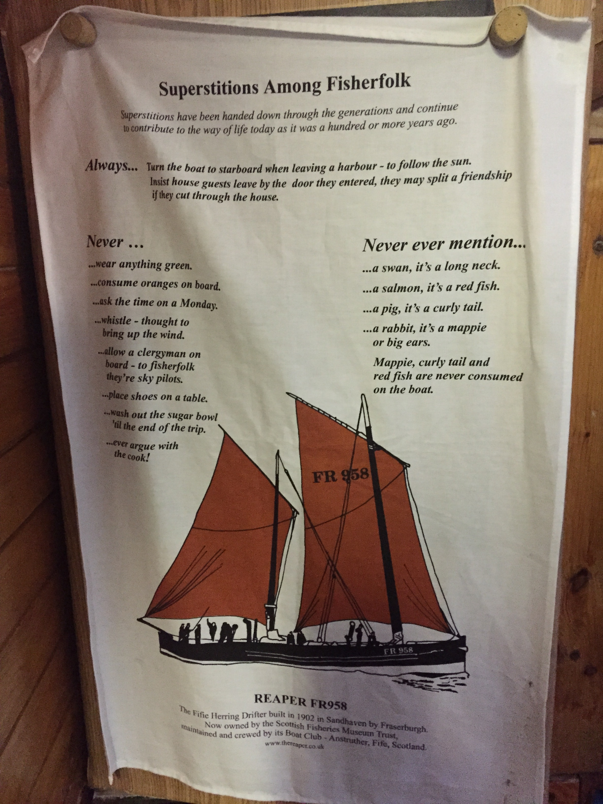
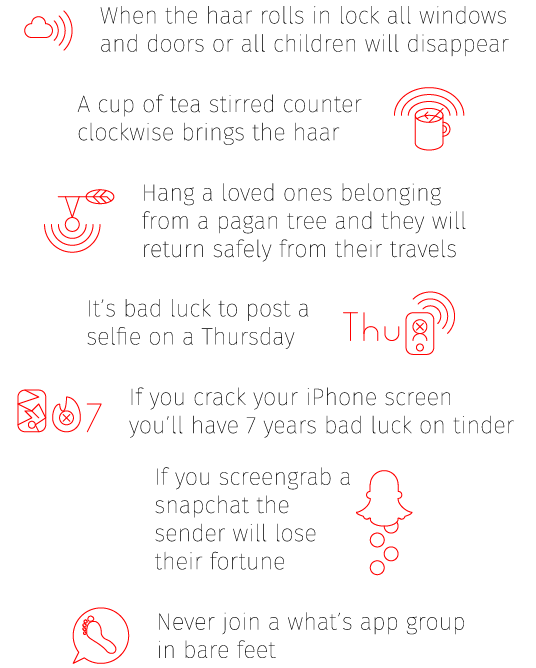
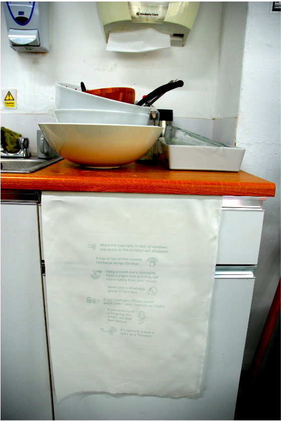

# Future Folklore

### Where do superstitions sit in a connect world? Inspired by the ‘Tea Towel of Fisheries Superstitions’ in the Scottish Fisheries Museum, we have made our own as a way to see thoughts and new myths.

*By Babitha George, Jayne Wallace, Nick Taylor, Mike Shorter, Erika Shorter, Justin Marshall, Sean at the Mozilla Open IoT Design Sprint in Anstruther, June 2016*

Inspiration found in Anstruther: 

Created by the team:

Tea Towel text: 

When the haar rolls in lock all windows and doors or all children will disappear

A cup of tea stirred counter clockwise brings the haar

Hang a loved ones belonging from a pagan tree and they will return safely from their travels

It’s bad luck to post a selfie on a Thursday

If you crack your iphone screen you’ll have 7 years bad luck on tinder

If you screengrab a snapchat the sender will lose their fortune

Never join a what’s app group in bare feet
